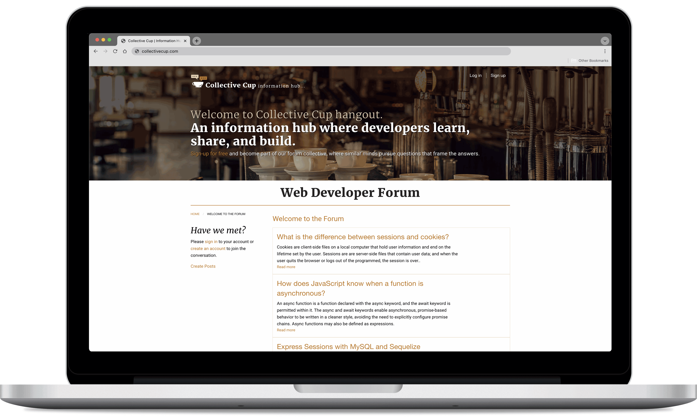
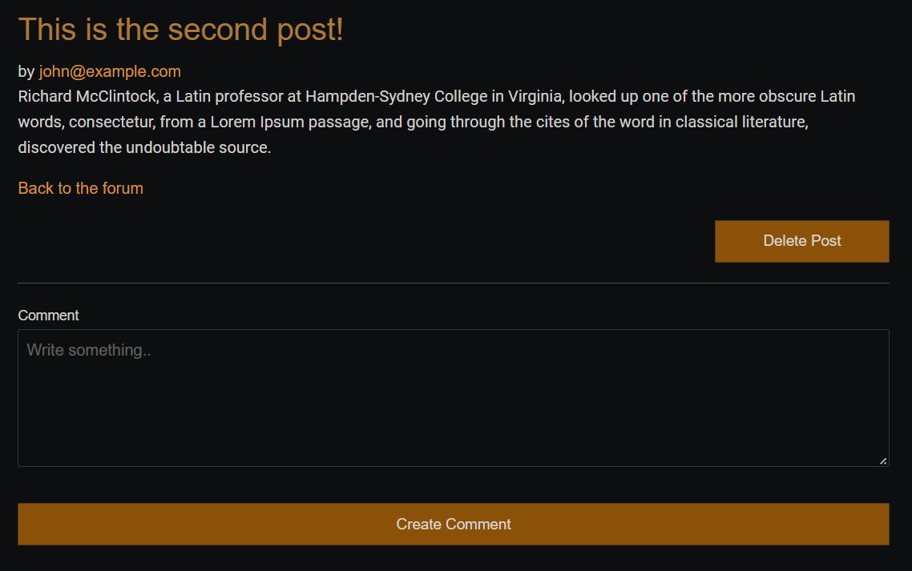

# Collective Cup - A Web Developer's Forum

## Description 
A full stack application, Collective Cup is a forum application where users can create posts pertaining to their coding journeys. Posts can be viewed on the front page, and individual posts have their own pages where users can leave comments. In order to interact with posts beyond simple viewing, a user must make an account and be signed in. Only after can they make and delete their own posts as well as leave comments. 

The app was built using the Model-View-Controllers structure. For the views, the Handlebars template language was used to create the display for the front end, with the Foundation CSS library used to generate the aesthetic of the site. Data creation on the front end is sent and stored in the local database on the backend to be retrieved and displayed back onto the front pages. MySQL is the database used to store data; Sequelize is the module that allows us to utilize object-relational mapping to manipulate and interact with the database using Javascript code. 

Since MySQL is a service that requires a password, in order to keep this sensitive information safe when displayed in a public repository, we use the Dotenv module to obscure that within the code when called by Sequelize and MySQL2. Users of the app will also have their passwords encrypted when they are stored within the database using the bcrypt module.

[Click here for the deployed app on Heroku.](https://project-two-group-five.herokuapp.com/)

### Collaborators 
- [Adeline Aguspranoto](https://github.com/adelineagus) 
    - adelineaguspranoto@gmail.com
- [Nathan Mayhook](https://github.com/jnmayhook) 
    - jnmayhook@gmail.com
- [Drew Payton](https://github.com/Drewpayton) 
    - drewpayton18@gmail.com
- [Sheryl Hu](https://github.com/reversedentistry) 
    - sherylhu@proton.me

### Technologies
- Javascript/Node.js
- Express.js
- MySQL
- MySQL2 module 
- Sequelize module 
- Dotenv module 
- BCrypt module
- Handlebars template language
- Insomnia API Client (or any API client)
- Foundation Framework 

## Installation Instructions
```
npm i 
```

## Usage Instructions 
To view posts and comments, a login is not required. To create, edit, or delete posts and comments, create an account using the Sign Up option. If an account already exists, log in in order to use the application's full features. 

To create a post, click the "Create Post" link. To add a comment, go to a post's individual viewing page and use the text box below the post text. 

### Screenshots





## License
This project is MIT licensed. 

